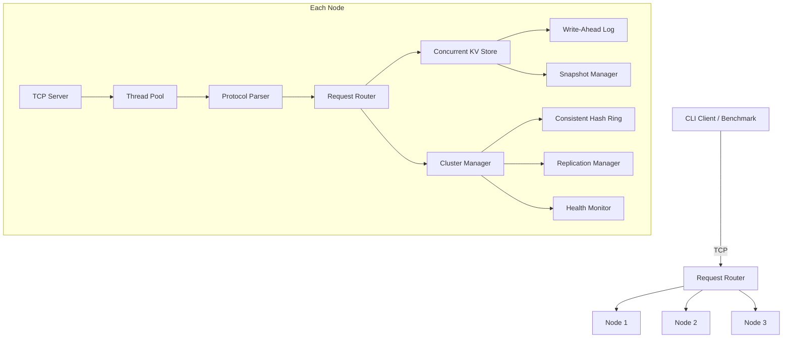

# Distributed Key-Value Storage System


## Overview
A distributed key-value store implemented in C++17. It features TCP networking, thread pool concurrency, WAL persistence, consistent hashing, replication, and fault tolerance.

## Architecture Diagram


## Features
- **TCP Networking**: High-performance multi-threaded server.
- **Persistence**: Write-Ahead Logging (WAL) and snapshotting for disaster recovery.
- **Cluster Mode**: Consistent hashing for key distribution.
- **Replication**: Primary/replica model for data availability.
- **Fault Tolerance**: Health monitoring and failover.

## Quick Start
```bash
cmake -B build && cmake --build build
./build/kv-server --port 7000
./build/kv-client --port 7000
cd build && ctest --output-on-failure
```

## Protocol
Uses a custom binary wire format for requests and responses.

## Cluster Mode
Can run in multi-node setup via `cluster.conf`.

## Docker
Run a 3-node cluster: `docker-compose up`

## Benchmarking
```bash
./benchmarks/run_benchmarks.sh
```

## Design Trade-offs
Simplicity vs perfect consistency (Eventual consistency favored).

## Tech Stack
C++17, POSIX sockets, CMake, GoogleTest, Docker.
